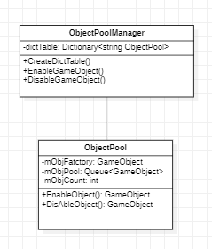

# ObjectPool
## ObjectPool 구조

* 각 object마다 ObjectPool을 만들어 미리 객체를 Enable하고 사용한뒤 Disable하도록 설계하였습니다
* ObjectPool들을 관리하는 ObjectPoolManager를 만들어 Object의 이름을 넣으면 해당 객체를 Enable,Disable하도록 설계하였습니다

## 수 많은 Monster, Projectile GameObject
* AgentCute의 경우 로그라이크형 + 탄막슈팅형 게임이기에 수 많은 Monster와 Projectile의 Object들이 존재합니다.
  이 오브젝트들을 매 생성시마다 Instantiate, 파괴시마다 Destory를 하게되면 다시 생성될 오브젝트임에도 불필요한 자원이 소모하게 됩니다.
  이를 해결하기 위해 빈번하게 생성 및 삭제가 되는 Object들은 Pool에 필요에 따라 넣었따 뺐다를 하여 관리를 하도록 하였습니다.

## TroubleShooting
### 동일오브젝트 반환이슈
* 이미 ObjectPool에 반환된 Object가 다시 불리게되면 이미 들어간 Object들 다시 넣어 ObjectPool이 꼬이게되는 버그가 발생하였습니다
  그래서 반드시 ObjectPool에 넣기전에는 activeInHierarchy를 True로 하여 반환하게하고 이를 ObjectPool에서 false로 바꿔준뒤 Disable하도록 룰을 수정하였습니다

