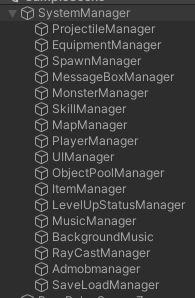

# SignleTone
```sh
public class SingleToneMaker<T> : MonoBehaviour where T : MonoBehaviour
{
    private static readonly object _padLock = new object();
    private static T instance = null;
    public static T Instance
    {
        get
        {
            lock (_padLock)
            {
                if (instance == null)
                {
                    //싱글톤 컴포넌트는 1개만 있어야하기에 여러개의 게임오브젝트에 들어있다면 그 자체로 이미 싱글톤이 아님
                    instance = GameObject.FindObjectOfType(typeof(T)) as T;
                    if (instance == null)
                    {
                        var singletonObject = new GameObject();
                        instance = singletonObject.AddComponent<T>();
                        singletonObject.name = typeof(T).ToString() + " (Singleton)";

                        DontDestroyOnLoad(singletonObject);
                    }
                }
                return instance;
            }
        }
    }
}

```

## Singletone

* AgentCute에서는 게임 실행시 각 Gameobject에서 다양한 정보들을 csv파일들을 통해 관리하고 있습니다
관리되는 데이터들은 다른 GameObject에 대한 접근이 필요하고 역할게 맡게 Manager를 만들어 접근을 하도록 설계되어있습니다.
이러한 접근들은 여러 GameObject에서 필요로 되는 경우가 많기에 필요시마다 객체를 만드는것은 낭비라 
싱글스레드 기반의 유니티 특징에 어울리는 Singletone을 활용하여 하나의 Instance만을 만들어 여러곳에서 접근할 수 있도록  하였습니다

## generic형태
* 다양한 Manager들이 만들어져있고 그때마다 Singletone을 만들수 없기에 generic을 활용하였습니다.


## TroubleShooting


