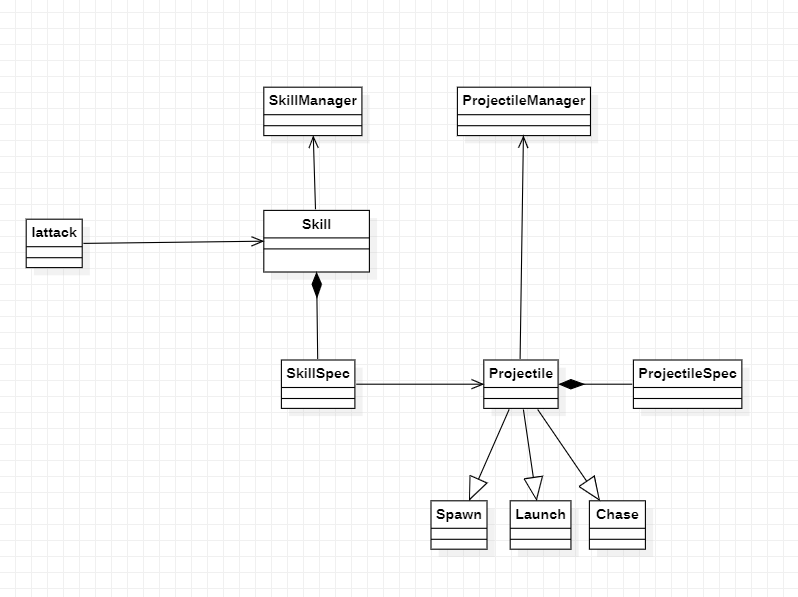

# Skill & Projectile 

## Skill & Projectile 구조


## Skill
* 모든 몬스터의 근접타격을 제외하고 Player, Monster의 공격방법은 모두 Skill.cs를 활용하여 이루어져 있습니다.
* Player, Monster 이외에 새로운 종류의 GameObject가 생성되거나, Player가 몬스터의 Skill을 사용 혹은 Monster가 Player의 스킬 사용등에 있어 확장이 용이한 구조입니다.
* skill은 여러개의 Projectile을 가지고 있으며 조건에 따라 Projectile이 발사되어집니다.

## Projectile
* 실제 발사 되어지는 탄막 GameObject입니다.
* Projectile은 발사체가 가져야하는 모든 정보를 가지고 있으며 현재는 3가지 하위 클래스 Spawn, Launch, Chase에서 컨셉에 따라 발사체를 다르게 설정하고 있습니다.
구현에 있어 새로운 발사체 컨셉이 생긴다면 확장에 있어 용이하도록 설계되어 있습니다.

## Iattack
* SKill의 spec 따라, Proejctile의 spec에 따라 실질적으로 미사일을 조건에 따라 방사시켜줍니다.

```sh
    protected List<GameObject> launchProjectile(Skill _skill, int _projectileIndex, Vector3 _targetPos, Vector3 _firePos, bool _notSingle)
    {
        List<GameObject> objList = new List<GameObject>();
        int launchCount;
        if (_skill.Spec.Type == "B")
            launchCount = TileDict[_skill][_projectileIndex].Spec.Count + mProjectileCount;
        else
            launchCount = TileDict[_skill][_projectileIndex].Spec.Count;
        int angle = TileDict[_skill][_projectileIndex].Spec.Angle;
        // 각도가 없을 경우 한발만 발사
        for (int i = 0; i < launchCount; i++)
        {
            objList.Add(
                LaunchCorutines(
                (launchCount == 1 ? 0 : -((launchCount - 1) * angle / 2) + angle * i),
                TileDict[_skill][_projectileIndex].gameObject.name,
                _targetPos,
                _firePos, _notSingle)
                );
        }
        return objList;
    }
```

```sh
    protected void FireSkillLaunchType(SkillLaunchType _enum, Skill _skill, int _count, Vector3 _target, Vector3 _fire, bool _notSingle, float _time)
    {
        if (DEBUG)
            Debug.Log(gameObject.name + "가 " + _enum.ToString() + "타입의 "+ _skill.name+ "을 "+_count+"번 사용합니다");
        switch (_enum)
        {            
            case SkillLaunchType.MULTISHOT:
                StartCoroutine(multiLuanch(_skill, _count, _target, _fire));
                break;
            case SkillLaunchType.NORMAL:
                launchProjectile(_skill, 0, _target, _fire, false);
                break;
            case SkillLaunchType.THROW:
                launchProjectile(_skill, 0, _target, _fire, false);
                break;
            case SkillLaunchType.LAUNCHMULTISHOT:
                LaunchInMultilaunchSkil(_skill, _count, _target, _fire);
                break;
            case SkillLaunchType.DELAYSHOT:
                StartCoroutine(DelayLaunchProjectile(_skill, 0, _target, _fire, _notSingle));
                break;
            case SkillLaunchType.DELAYMULTISHOT:
                StartCoroutine(DelayMultiLuanch(_skill, 0, _count, _target, _fire));
                break;
            case SkillLaunchType.RUSH:
                StartCoroutine(RushAndLuanch(_skill, 0, _target, _time));
                break;
            case SkillLaunchType.WARINGSHOT:
                StartCoroutine(WaringAndLuanch(_skill, _target, _fire));
                break;
            default:
                Debug.Log("잘못된 Enum타입 " + _enum.ToString() + "이 들어왔습니다");
                break;
        }
    }
```


## data
Skill과 Projectile 데이터는 각각 SkillManager, ProjectileManager에서 read를 해오고 각각 SkillSpec,ProjectileSpec에 csv의 내용을 저장하여 
실제 발사체가 나갈때 참조되어 데이터가 설정됩니다.

