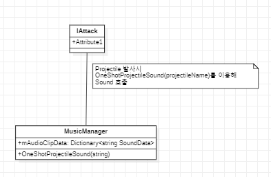

# Sound

## Sound 구조



## BGM
* 각 맵에 대한 BGM은 Resources 폴더에 [맵 이름으로 관리](../../Assets/Resources/Sound/BGM)되고 있습니다. 맵이 시작하면 해당 맵 BGM을 틀어주는 형태로 구현되어있습니다.  

## Projectile Sound
* 각 Projectile Sound는 [SoundEffect.csv](../../Assets/Resources/CSVFile/SoundEffect.csv)에 Projectile명에 따른 Sound를 저장하여 Projectile이 생성될때 마다 소리가 나도록 설계하였습니다
* csv를 통해 기획자들이 Sound의 소리크기, Projectile에 따른 Sound를 data수정만을 통하여 수정할수 있게 하여 Test를 쉽게 할 수 있는 Data Driven형태로 설계되어있습니다.


## TroubleShooting
* 유니티 특성상 Sound가 mix되면 증폭현상이 발생되어 동일 Projectile이 동시에 나가면 소리가 깨지는 현상이 발생하였습니다.
  이에따라 하나의 Sound가 나가면 Sound가 종료되기전까지 전체 Sound의 크기를 일정비율로 줄여 소리가 깨지는 현상을 방지하였습니다.
  현재 0.3f기준으로 하나의 Projectile이 나가면 소리가 줄어드는 방식으로 구현되어있는데 각 Sound의 시간을 csv에 받아 사용한다면
  증폭에 따른 소리감소를 좀 더 Detail하게 다룰 수 있습니다.

```sh
    IEnumerator SoundAmplificationDecrease()
    {
        mAmplificationScale *= 0.9f;
        yield return new WaitForSeconds(0.3f);
        mAmplificationScale *= 10 / 9f;
    }
```

## 개선방안
* 현 구조가 초기 설계시 Projectile이 Unique key가 Int로 된 Id가 아닌 String으로 구현된 상태입니다.
  Projectile의 구조를 key가 Id로 변경을 한다면 OneShotProjectileSound 사용시 더 최적화가 가능합니다.
