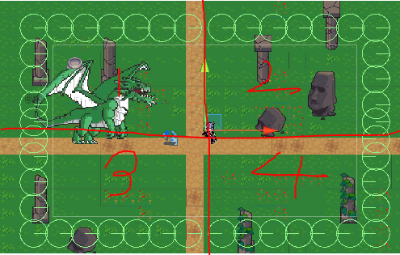

# Spawn

## Spawn 구조

## Spawn 방식

* 몬스터가 적은 부분에 대해서 우선 스폰 하도록 설계되어 있습니다.
* 화면을 4가지로 분할을 한다음 Physics2D.OverlapBoxAll을 이용하여 각 분할된 맵에서 LayerMask가 "Monster"로 되어있는 object의 수를 구하고 가장 적은 부분부터 spawn을 하도록 설계하여 Player가 몬스터에 둘러쌓일수 있도록 설계되어 있습니다

## data 관리
* Monster에 대한 정해진 detail한 정보는 MonsterManager에서 [MonsterData.csv](../../Assets/Resources/CSVFile/MonsterData.csv)에 대한 정보를 read해와 Dictionary로 가지고 있다 game object Spawn시 필요시마다 write해줍니다.
* 각 맵에 따른 spawn 정보는 [SpawnData.csv](../../Assets/Resources/CSVFile/SpawnData.csv)에서 관리하고 있고 현재 맵이랑 같은 Field정보에 대한 SpawnData를  정보를 List형태로 저장하고 있다 조건에 따라 spawn 되어지도록 설계되어있습니다.   
* 그 외 spawn시 wave마다 몬스터가 강해지는 컨셉, 보스몬스터의 버서커모드 등에 대한 data를 모두 csv파일로 관리하며 기획단계에서 csv파일 수정만으로 데이터를 변경할 수 있게
data driven이 용이하도록 설계되어있습니다.

