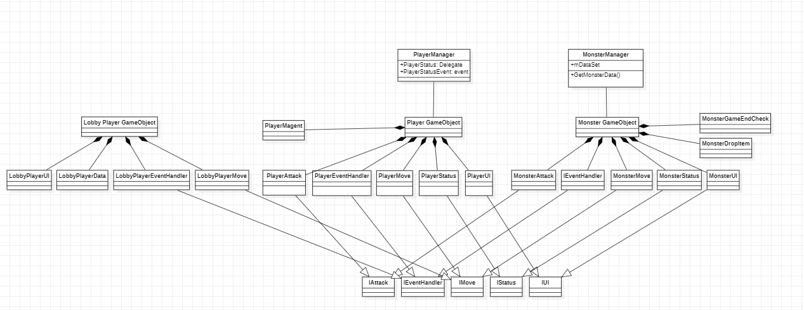

# Unit 구조
## 클래스구조

* 인게임에서 Player나 Monster로 나타는 GameObject들은 공통적인 부분이 많기에 최대한 상위 클래스에 공통정보를 모아 만들었습니다
* 각각 기능별로 변경이 가능한 부분은 가상함수로 만들어 필요에 따라 수정을 할 수 있도록 구조를 만들었습니다
* 

## 확장의 자유로움
* 컴포넌트 언어의 장점을 살려 각 Object가 기획변경에 의해 추가적으로 필요한 요소들이 생기면 컨셉에 맞게 구현이후 컴포넌트만 추가해주었습니다
  실례로 자석기능이 기획과정에서 추가되었고 Player에게 PlayerMagent.cs파일을 추가하여 다른 소스를 수정하지 않고 기능을 추가했습니다

## 재활용
* 초기 설정은 Player, Monster만이였으나 로비 기능이 추가되면서 로비에서 사용할 Player GameObject가 필요해졌습니다
  이에 따라 기존에 만들었던 상위 클래스에 로비 플레이어 필요한 것들만 상속을 받아 새로 모든 코드를 짤 필요없이 재활용할 수 있는 형태로 설계하였습니다.

