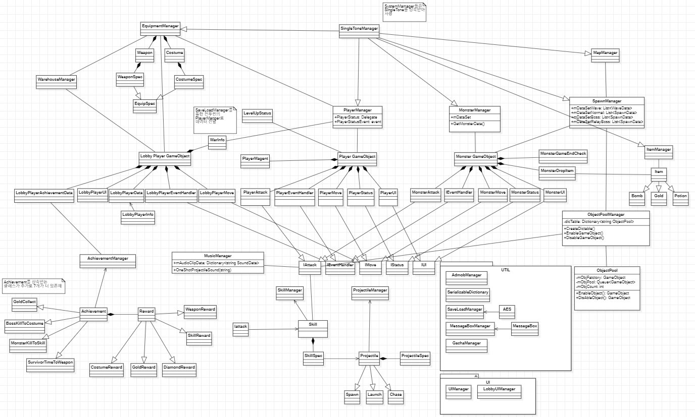

# Agent Cute : Action Survivors
> 로그라이크 장르의 액션서바이버게임

## 게임 플레이 화면

유튜브 링크로 대체 예정

## 설치방법

```sh
구글스토어 업로드 완료시 링크 올릴예정
```

## 개발 기간
* 2022.3.20~ 2022. 5.18

## 프로젝트 전체 구성(UML)

## 프로젝트 리뷰

* [몬스터 이동 알고리즘](./Docs/move/Move.md)

* [싱글톤](./Docs/singletone/Singletone.md)

* [Unit 구조](./Docs/unit/Unit.md)

* [몬스터 스폰 구조](./Docs/unit/Spawn.md)

* [Skill, Projectile 구조](./Docs/skill/Skill.md)

* [Sound](./Docs/sound/Sound.md)

* [ObjectPool](./Docs/objectpool/ObjectPool.md)

* [EventHandler](./Docs/EventHandler/EventHandler.md)

* 무한맵 로직

* [데이터 관리방식](./Docs/data/data.md)

* [serialize](./Docs/serialize/Serialize.md)

* 로비구성

* [Load & Save](./Docs/load&save/load&save.md)

* [구글 광고](./Docs/GoogleAds/GoogleAds.md)


## Trouble Shooting 처리내역

* [중복 사망 이슈](./Docs/EventHandler/EventHandler.md/#troubleshooting)

* [음향 증폭 이슈](./Docs/sound/Sound.md/#troubleshooting)

* [동일오브젝트 반환이슈](./Docs/objectpool/ObjectPool.md/#troubleshooting)


* [구글 애드몹 보상형 광고 모바일 환경 앱 크래시 이슈](./Docs/GoogleAds/GoogleAds.md)
## 맺으며
